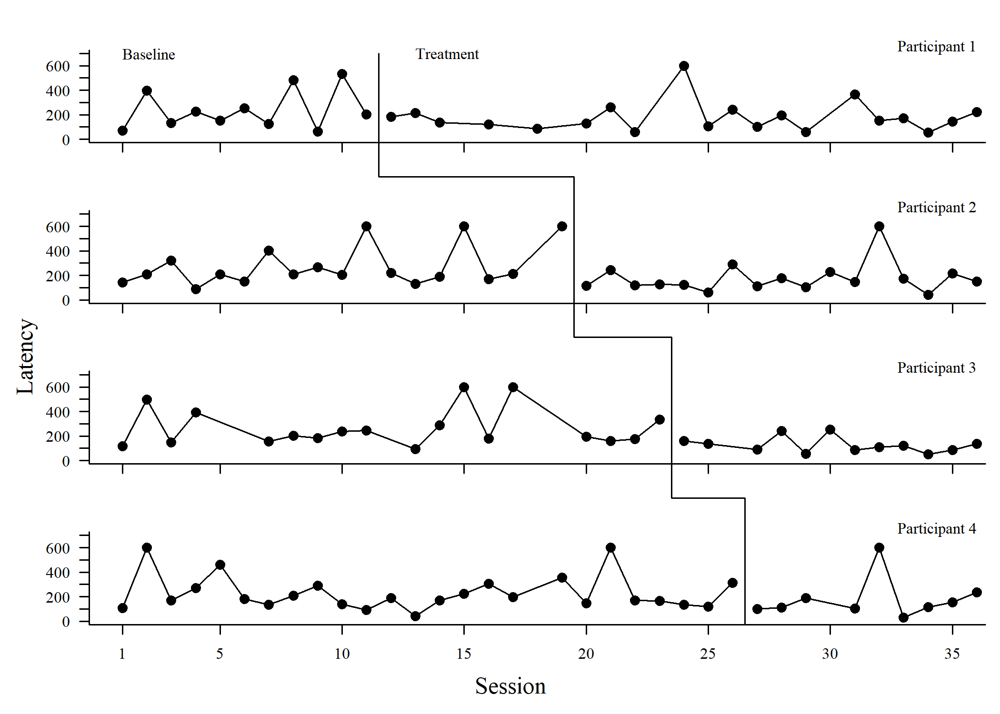
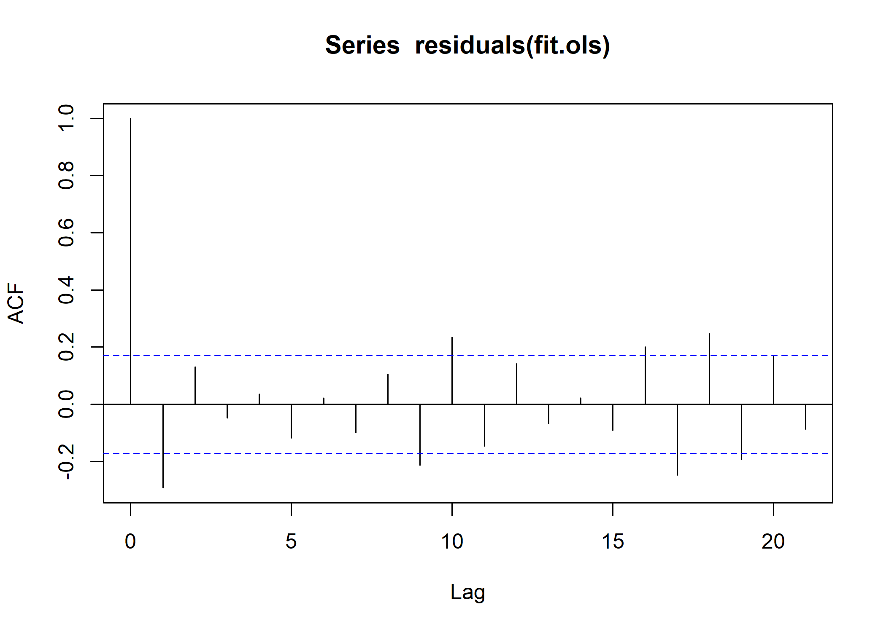
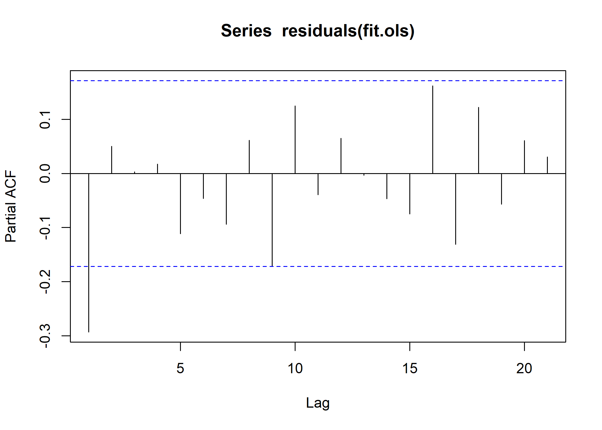
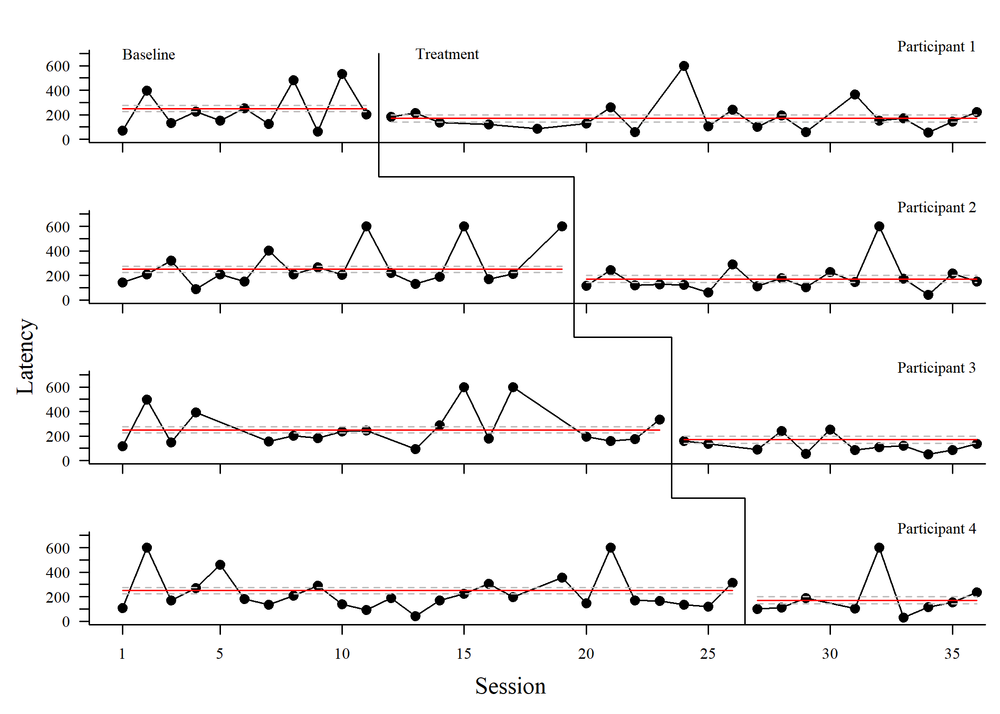

# Single Case Design Evaluation

[Shawn Gilroy](mailto:sgilroy1@lsu.edu), 7/11/2022

``` r
knitr::opts_chunk$set(echo = TRUE, 
                      fig.path = "plots/",
                      dev = "png",
                      dpi = 300)

# Include for piping
suppressPackageStartupMessages(library(dplyr))

# Included for calculating FE CI's
suppressPackageStartupMessages(library(emmeans))

# Single-case plotting methods (MUST INSTALL FROM GITHUB, NOT CRAN)
suppressPackageStartupMessages(library(fxl))

# Methods for generating p-values for MLMs
suppressPackageStartupMessages(library(lmtest))

# Core fitting libraries
suppressPackageStartupMessages(library(nlme))

# Read in data 
data = read.csv("CASCD_Data_Clean.csv") %>%
  filter(!is.na(Latency))
```

## Descriptive Illustration of Data

Just eyeballing the data, more evidence of a level shift than trend
shift but wise to formally evaluate them all.

<!-- -->

## Fits using Ordinary Least Squares (OLS; Piecewise Level/Trend)

Fits to a piecewise model evaluating changes in level/trend are first
reviewed using OLS. Autocorrelated errors are potentially an issue and
will need to be directly evaluated.

``` r
fit.ols = lm(Latency ~ Session + Phase + SC, 
             data = data)

summary(fit.ols)
```

    ## 
    ## Call:
    ## lm(formula = Latency ~ Session + Phase + SC, data = data)
    ## 
    ## Residuals:
    ##     Min      1Q  Median      3Q     Max 
    ## -213.80  -89.22  -39.24   38.24  431.58 
    ## 
    ## Coefficients:
    ##              Estimate Std. Error t value Pr(>|t|)    
    ## (Intercept)  242.6868    27.8348   8.719 1.39e-14 ***
    ## Session        0.8546     2.0415   0.419   0.6762    
    ## PhaseINT    -108.1323    44.7865  -2.414   0.0172 *  
    ## SC             1.0873     3.1531   0.345   0.7308    
    ## ---
    ## Signif. codes:  0 '***' 0.001 '**' 0.01 '*' 0.05 '.' 0.1 ' ' 1
    ## 
    ## Residual standard error: 141.2 on 126 degrees of freedom
    ## Multiple R-squared:  0.08394,    Adjusted R-squared:  0.06213 
    ## F-statistic: 3.849 on 3 and 126 DF,  p-value: 0.01124

``` r
acf(residuals(fit.ols))
```

<!-- -->

``` r
acf(residuals(fit.ols), type = "partial")
```

<!-- -->

``` r
dwtest(fit.ols, alternative = "two.sided")
```

    ## 
    ##  Durbin-Watson test
    ## 
    ## data:  fit.ols
    ## DW = 2.5736, p-value = 0.002231
    ## alternative hypothesis: true autocorrelation is not 0

Note: Durbin-Watson test suggests that degree of autocorrelation in OLS
residuals is non-trivial.

## Fits using Generalized Least Squares (Piecewise Level/Trend)

Generalized least squares approach fitted with an autoregressive
correlation structure, with and without random effects.

``` r
# Without random effects
fit.gls = gls(Latency ~ Session + Phase + SC,
              method = "ML",
              correlation = corARMA(p = 1, 
                                    form = ~ Session | Participant),
              data = data)

# With random intercepts and slopes per participant
fit.lme = lme(Latency ~ Session + Phase + SC,
              data = data,
              method = "ML",
              correlation = corARMA(p = 1, 
                                    form = ~ Session | Participant),
              random = ~ 1 + Phase + SC | Participant)

anova(fit.gls, fit.lme)
```

    ##         Model df      AIC      BIC    logLik   Test      L.Ratio p-value
    ## fit.gls     1  6 1654.428 1671.633 -821.2141                            
    ## fit.lme     2 12 1666.428 1700.839 -821.2141 1 vs 2 3.160587e-07       1

Note: Comparing across fits using Likelihood Ratio Tests (Maximum
Likelihood fits set for both), results indicated that the added
complexity introduced by the random effects isn’t justified, given the
data.

## Model Selection for Generalized Least Squares

Minimal trending was observed in the data and factor specific to
trend/changes in trend are evaluated.

``` r
fit.gls2 = gls(Latency ~ Phase,
               method = "ML",
               correlation = corARMA(p = 1, 
                                     form = ~ Session | Participant),
               data = data)

anova(fit.gls, fit.gls2)
```

    ##          Model df      AIC      BIC    logLik   Test   L.Ratio p-value
    ## fit.gls      1  6 1654.428 1671.633 -821.2141                         
    ## fit.gls2     2  4 1650.553 1662.023 -821.2763 1 vs 2 0.1243456  0.9397

Overall, given the data, the inclusion of a slope/slope change factor
did not significantly improve model performance. TLDR; trend not worth
the df.

As a test against a null effect for phase differences, an intercept-only
model was fitted and compared against the Phase-only model.

``` r
fit.gls3 = gls(Latency ~ 1,
               method = "ML",
               correlation = corARMA(p = 1, 
                                     form = ~ Session | Participant),
               data = data)

anova(fit.gls2, fit.gls3)
```

    ##          Model df      AIC      BIC    logLik   Test  L.Ratio p-value
    ## fit.gls2     1  4 1650.553 1662.023 -821.2763                        
    ## fit.gls3     2  3 1664.056 1672.659 -829.0279 1 vs 2 15.50323   1e-04

Results suggested that data were most likely to have emerged from a
model featuring only Phase level differences.

## Evaluating Autocorrelation Adjustments

As a final point of adjustment, varying lag sizes are evaluated.

``` r
fit.gls2.1 = fit.gls2
fit.gls2.2 = update(fit.gls2, 
                    correlation = corARMA(p = 2, 
                                          form = ~ Session | Participant))
anova(fit.gls2.1, fit.gls2.2)
```

    ##            Model df      AIC      BIC    logLik   Test   L.Ratio p-value
    ## fit.gls2.1     1  4 1650.553 1662.023 -821.2763                         
    ## fit.gls2.2     2  5 1652.262 1666.600 -821.1311 1 vs 2 0.2904963  0.5899

``` r
fit.gls2.3 = update(fit.gls2, 
                    correlation = corARMA(p = 3, 
                                          form = ~ Session | Participant))
anova(fit.gls2.1, fit.gls2.3)
```

    ##            Model df      AIC      BIC    logLik   Test   L.Ratio p-value
    ## fit.gls2.1     1  4 1650.553 1662.023 -821.2763                         
    ## fit.gls2.3     2  6 1654.032 1671.237 -821.0159 1 vs 2 0.5208981  0.7707

``` r
fit.gls2.4 = update(fit.gls2, 
                    correlation = corARMA(p = 4, 
                                          form = ~ Session | Participant))
anova(fit.gls2.1, fit.gls2.4)
```

    ##            Model df      AIC      BIC    logLik   Test  L.Ratio p-value
    ## fit.gls2.1     1  4 1650.553 1662.023 -821.2763                        
    ## fit.gls2.4     2  7 1655.156 1675.229 -820.5782 1 vs 2 1.396327  0.7064

Results indicated that there were no significant improvements beyond a
lag of 1.

<!-- -->

## Interpretation of Fixed Effects

``` r
summary(fit.gls2)
```

    ## Generalized least squares fit by maximum likelihood
    ##   Model: Latency ~ Phase 
    ##   Data: data 
    ##        AIC      BIC    logLik
    ##   1650.553 1662.023 -821.2763
    ## 
    ## Correlation Structure: ARMA(1,0)
    ##  Formula: ~Session | Participant 
    ##  Parameter estimate(s):
    ##      Phi1 
    ## -0.282217 
    ## 
    ## Coefficients:
    ##                 Value Std.Error   t-value p-value
    ## (Intercept) 250.66928  12.71680 19.711667   0e+00
    ## PhaseINT    -79.64394  19.34971 -4.116028   1e-04
    ## 
    ##  Correlation: 
    ##          (Intr)
    ## PhaseINT -0.666
    ## 
    ## Standardized residuals:
    ##        Min         Q1        Med         Q3        Max 
    ## -1.5144891 -0.5968643 -0.3103414  0.3323063  3.0838735 
    ## 
    ## Residual standard error: 139.1025 
    ## Degrees of freedom: 130 total; 128 residual

On the overall, the latency observed across individuals decreased as a
function of 79.64 units following intervention.
